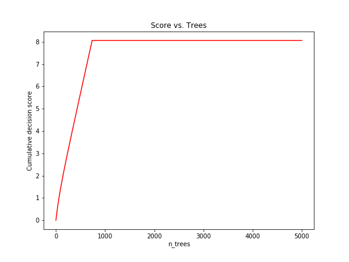
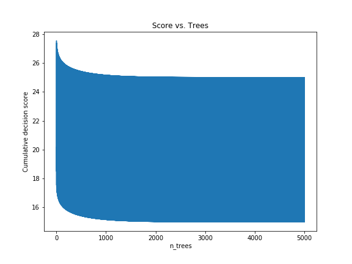

# Gradient Boosting Resources

The notebook discusses the basics of how Gradient Boosting works answers the question: "Will performance of GBDT model drop dramatically if we remove the first tree?" The major contents of this notebook are from the Coursera course on ["How to Win a Data Science Competition"](https://www.coursera.org/learn/competitive-data-science), course 2 in the [advanced machine learning specialization](https://www.coursera.org/specializations/aml).

## Plots from Notebook

## Useful Links

* [XG Boost](https://github.com/dmlc/xgboost)

* [Light GBM](https://github.com/dmlc/xgboost)

* [Medium Article](https://medium.com/mlreview/gradient-boosting-from-scratch-1e317ae4587d)

* [Short Youtube Video on ADA Boost](https://www.youtube.com/watch?v=GM3CDQfQ4sw)

* [Kaggle Master Explain](http://blog.kaggle.com/2017/01/23/a-kaggle-master-explains-gradient-boosting/)