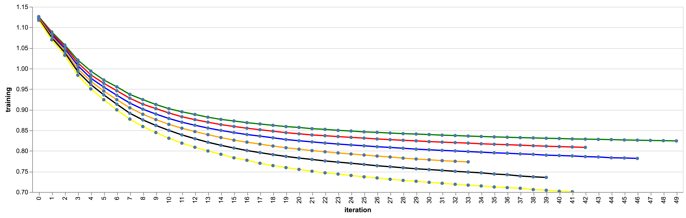

# Hyper Parameter Tuning Resources

## Overfitting and Tree Depth

As we increase the max_depth attribute of our tree by 1, the model is able to generalize and fit our dataset better. The plot below shows this; the highest line belongs to the a tree of depth 8 and the lowest line belongs to depth of 13, when evaluating rmse score on the train data.

### Useful Links

* [Tuning Xgboost - Medium Article](https://towardsdatascience.com/fine-tuning-xgboost-in-python-like-a-boss-b4543ed8b1e)