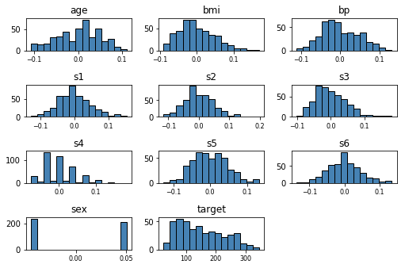
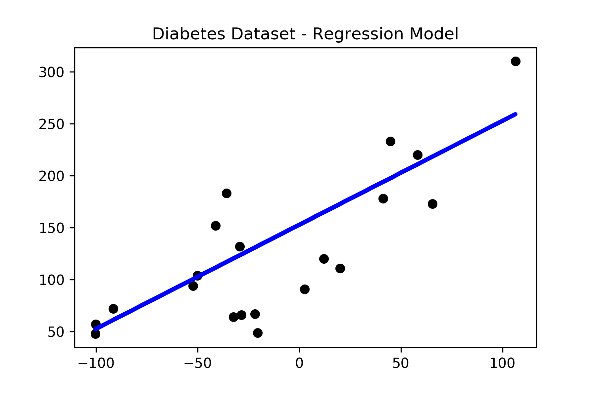

# Linear Regression Resources

## Diabetes Dataset

Applying a linear regression model on the diabetes dataset from scikit learn library.

### Dataset

### Exploratory Data Analysis

#### Visualizing Dataset in 1 Dimension

#### Regression Plot

## Useful Links

* [Scikit Learn](https://scikit-learn.org/stable/modules/linear_model.html#linear-regression)