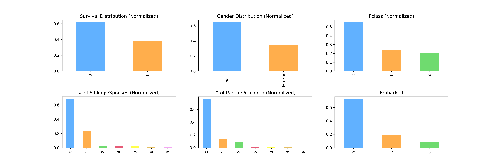

# Logistic Regression Resources

## Titanic Dataset

Visualizing the infamous Titanic Dataset and applying a logistic regression model from scikit learn library.

### Exploratory Data Analysis

### Kaggle Submission Link

* [Titanic](https://www.kaggle.com/sarthakbatra/titanic-eda-and-logistic-regression/)

## Useful Links

* [Scikit Learn](https://scikit-learn.org/stable/modules/linear_model.html#logistic-regression)