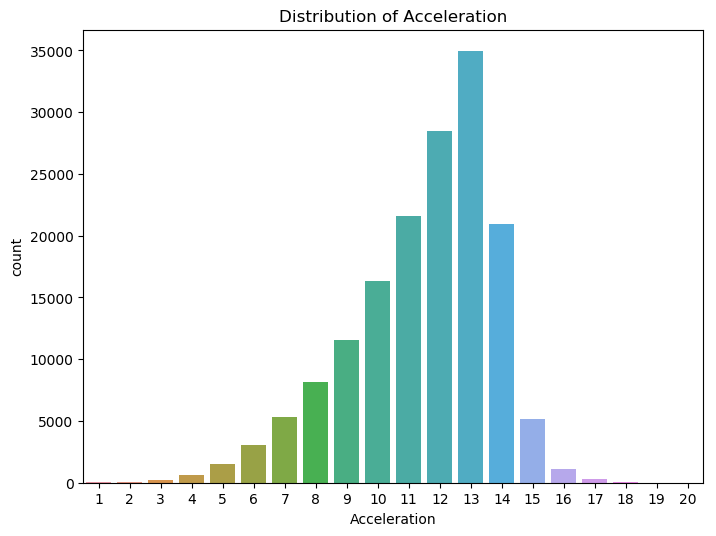
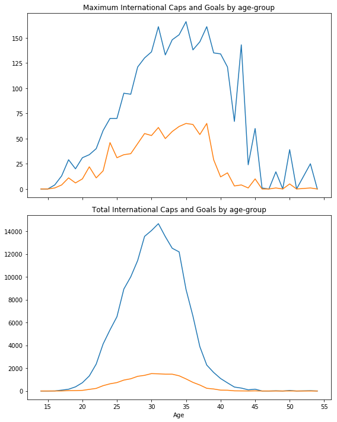
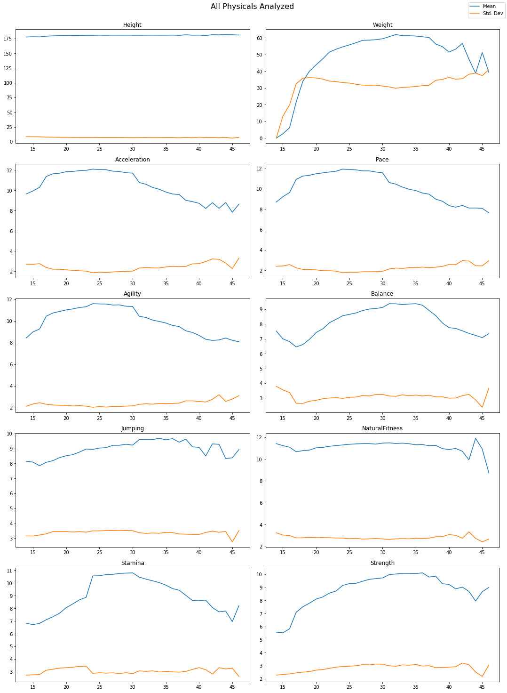
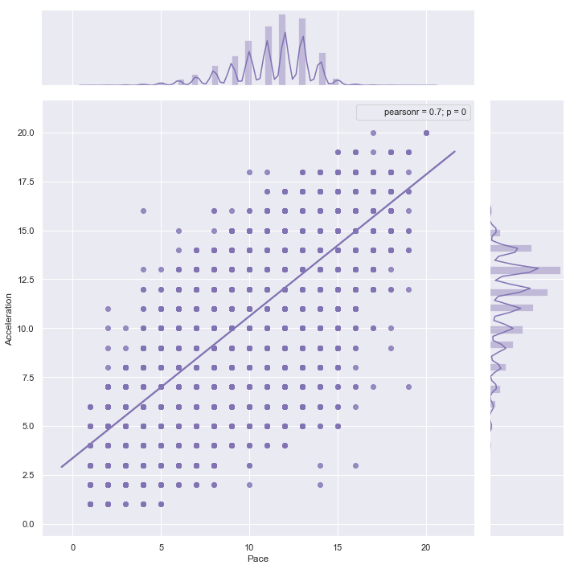
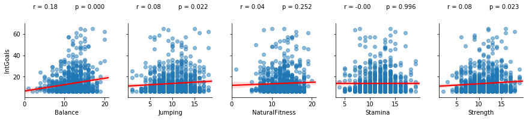
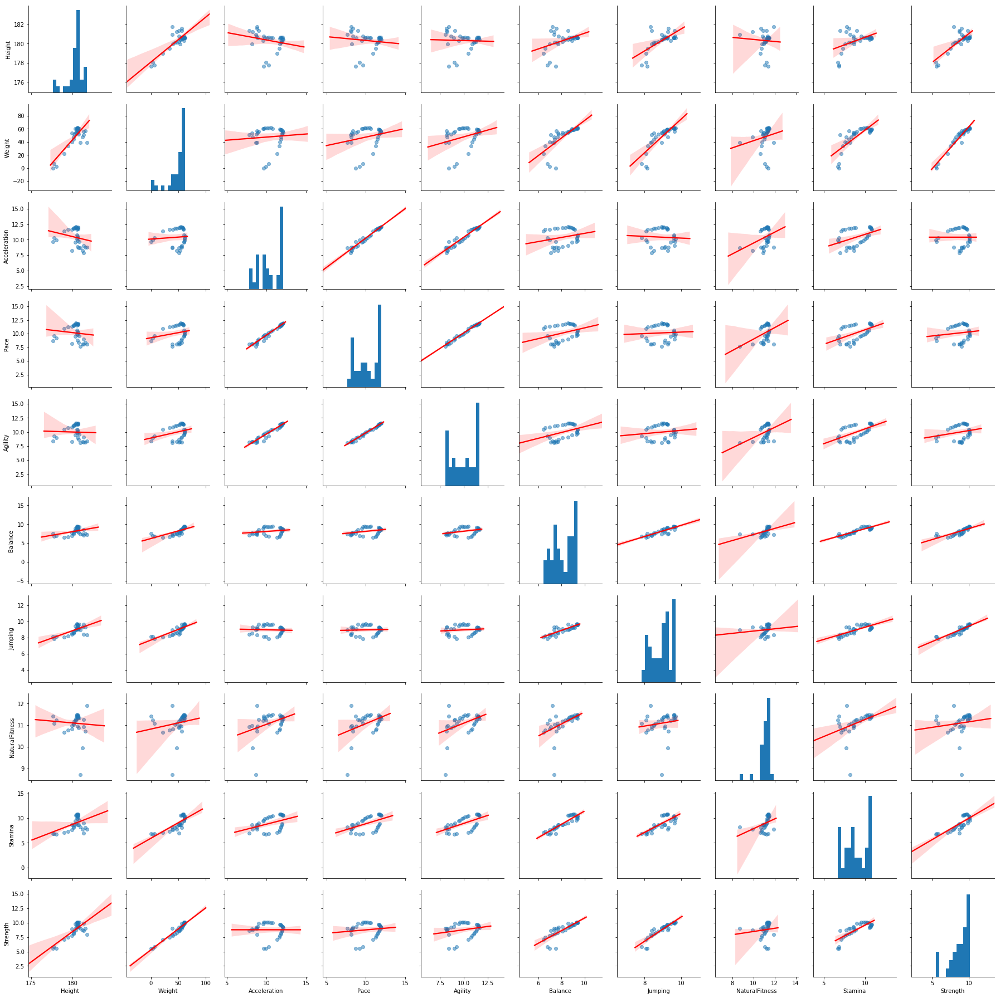

# Football Manager Dataset

* Over 150,000 football manager 2017 players with over 80 features/attributes to analyze!
* Data can be found on Kaggle [here](https://www.kaggle.com/ajinkyablaze/football-manager-data)
* To begin, download project requirements:

```Python
pip install -r requirements.txt
```

## Plots  

### Distribution of Acceleration



### International Goals and Caps by Age Group



### Player Phyicals Attributes Analyzed



### Jointplot of Acceleration and Pace



### Correlation between International Goals and Physical Attributes




### Scatterplot matrix of Physical Attributes

