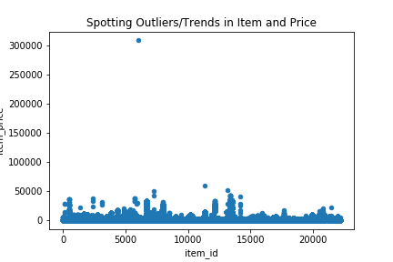
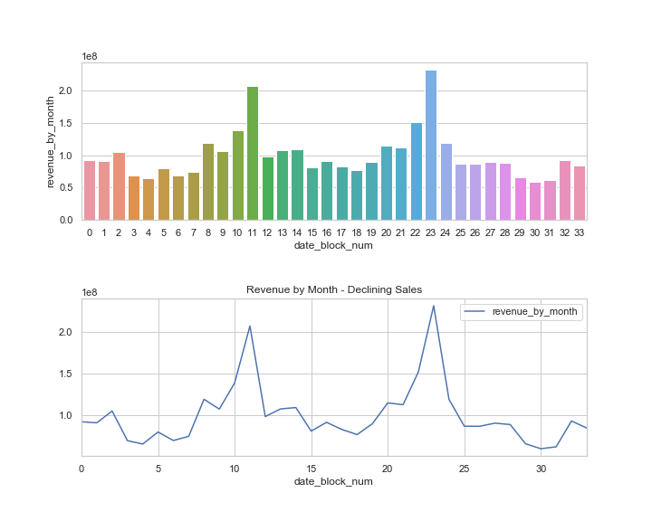
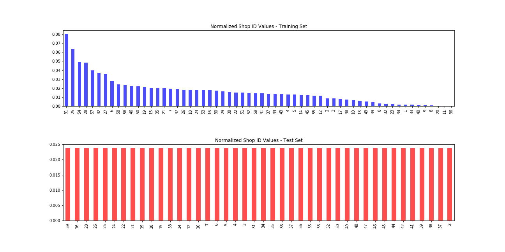

# Sales Transactions Data Visualied

In the [Data Wrangling](https://github.com/sarthakbatragatech/100-Days-of-ML/tree/master/Data-Wrangling) and [Time-Series Forecasting](https://github.com/sarthakbatragatech/100-Days-of-ML/tree/master/Time-Series-Forecasting) section, I dealt with sales transactions data from the Russian software company, 1C. The notebooks in those sections perform a little EDA (Exploratory Data Analysis) on the dataset and in this standalone notebook, I will create a few visualizations/charts with the general context in mind.

## The Dataset

The link to the dataset, as shared in the other folders, can be found below:

* [Dataset information](https://www.kaggle.com/c/competitive-data-science-predict-future-sales/data)

## Plots

### Outliers in Item Price

### Declining Sales

### Shop ID distribution in training and test set

